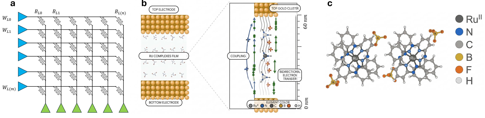
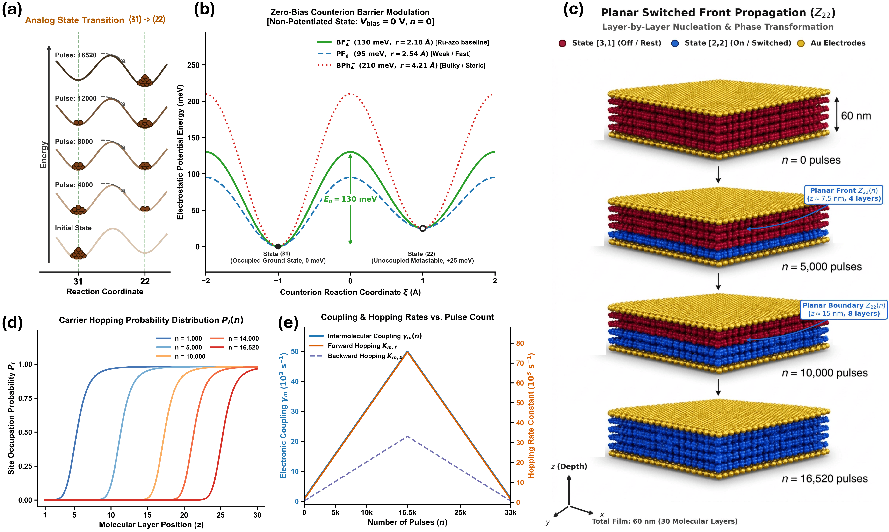
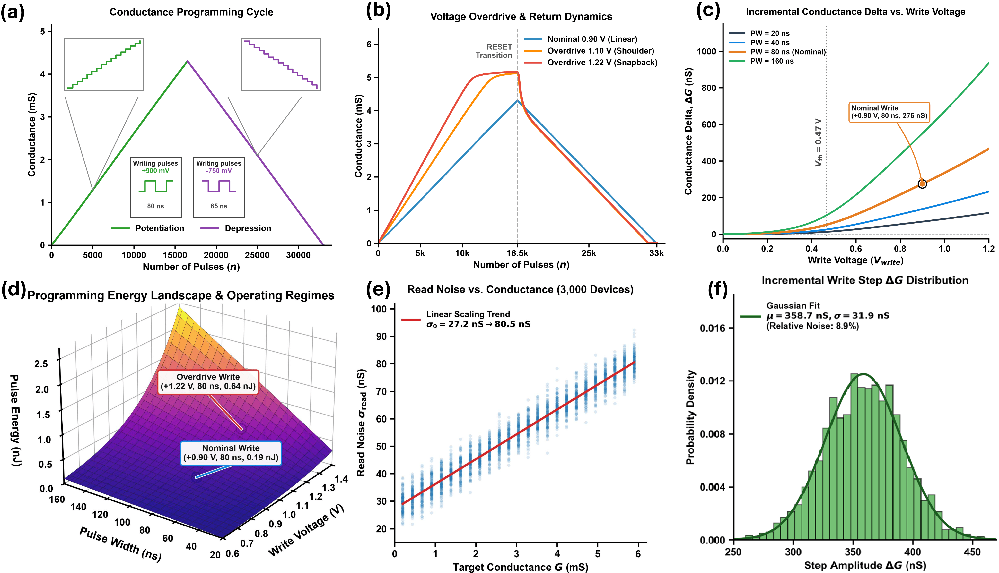
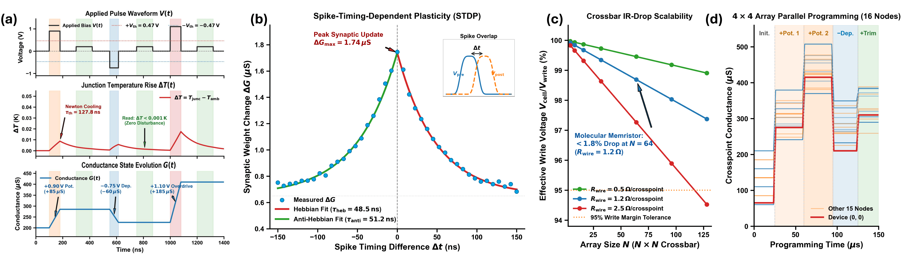
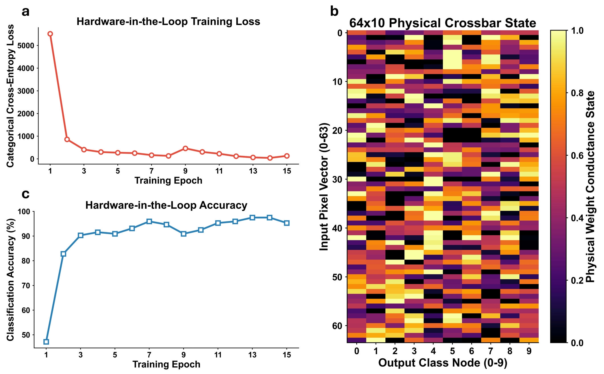
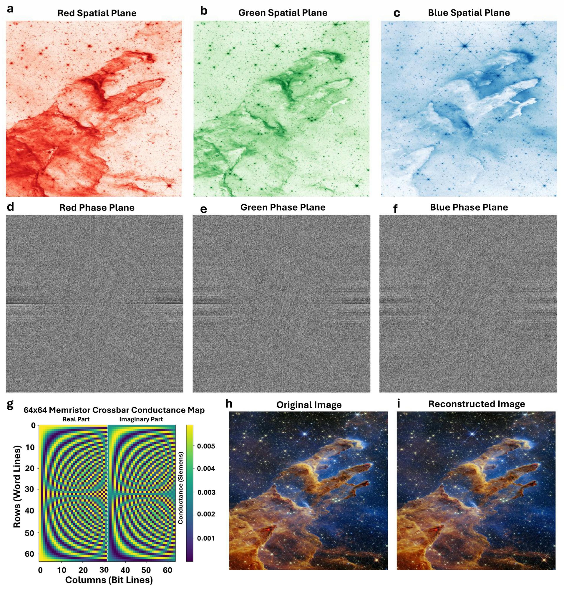

# MolMem: High-Speed Continuous Kinetic Simulation for 14-Bit Molecular Memristors

[](https://www.python.org/)
[](https://numba.pydata.org/)
[](https://pytorch.org/)
[](https://www.tensorflow.org/)
[](LICENSE)

> **Next-generation analog in-memory computing grounded in true molecular physics.**  
> MolMem bridges nanoscale electron transfer kinetics with macroscale crossbar architectures, delivering a vectorized $O(1)$ simulation engine capable of evaluating 14-bit linear conductance states (16,520 levels) across deep learning accelerators, complex analog image processing pipelines, and transistor-level circuit netlists.

---

## Visual Overview & Architecture

<p align="center">
  
</p>

* **(a)** Scalable crossbar architecture deploying molecular memristors at each crosspoint.
* **(b)** 60 nm $[\text{Ru}^{\text{II}}\text{L}_2](\text{BF}_4)_2$ molecular thin film sandwiched between gold electrodes.
* **(c)** Bis-tridentate ruthenium coordination complex exhibiting deterministic redox-coupled counterion displacement.

---

## Why MolMem?

Traditional memristor modeling forces a difficult tradeoff: slow, fragile device-level PDE solvers that stall on multi-device crossbars, or abstract behavioral curve-fits that fail to capture physical non-idealities.

**MolMem resolves this bottleneck** by formulating continuous, infinitely differentiable rate equations anchored in thermodynamic transport theory:

| Feature | Stochastic Filamentary RRAM | Phase Change Memory (PCM) | **Molecular Memristor (MolMem)** |
| :--- | :---: | :---: | :---: |
| **Switching Mechanism** | Stochastic ion migration | Melt-quench / crystallization | **Thermodynamic electron transfer** |
| **Analog Resolution** | $< 64$ levels ($< 6$-bit) | $< 100$ levels | **16,520 levels (14-bit)** |
| **I-V Linearity** | Highly non-linear | Non-linear | **Linear symmetric** |
| **Simulation Speed** | Slow iterative solvers | Lookup tables / empirical | **Vectorized $O(1)$ interpolation engine** |
| **Convergence** | Frequent Jacobian stalls | Empirical curve fits | **$C^1$-smooth, zero solver divergence** |

---

## Full-Stack Workflow Architecture

The repository provides a complete device-to-algorithm pipeline connecting four specialized modules:

```plaintext
   [ PhysicsFitting/ ]               [ DeviceFitting/ ]
Microscopic DFT Transport         Macroscopic Pulse Data
 Marcus Rates & Screening       Arrhenius Barrier & Clamping
            │                                 │
            └───────────────┬─────────────────┘
                            ▼
      ┌───────────────────────────────────────────────┐
      │               Extracted Parameters            │
      └─────────────────────┬─────────────────────────┘
                            │
            ┌───────────────┴─────────────────┐
            ▼                                 ▼
   [ PythonSimulator/ ]           [ MolmemVirtuosoSpectreV1.0/ ]
  High-Speed Crossbars &             Transistor-Level Compact
Hardware-in-the-Loop AI              Model for Circuit Solvers
```

---

## Key Capabilities

### 1. True Device Physics, Zero Heuristic Shortcuts
* **Marcus-Hush Electron Transfer**: Formulates dynamic $(31) \leftrightarrow (22)$ redox transitions across 30 molecular layers.
* **Thomas-Fermi Screening**: Predicts internal potential redistribution under mobile counterion accumulation.
* **Dynamic Self-Heating & Newton Cooling**: Integrates instantaneous Joule heating ($R_{\text{th}} = 52.14$ K/W) with rapid thermal relaxation ($\tau_{\text{th}} = 127.8$ ns), demonstrating bounded heating ($\Delta T \le 0.018$ K) and zero read disturbance at subthreshold voltages ($V_{\text{read}} < 0.47$ V).

<p align="center">
  
</p>

### 2. Full 14-Bit Precision & Experimental Noise Channels
* **16,520 Linear States**: Simulates symmetric potentiation (+0.90 V, 80 ns) and depression (-0.75 V, 65 ns) spanning 200 nS to 2.05 mS.
* **Overdrive Memory**: Captures non-equilibrium counterion accumulation, extended potentiation shoulders, and depression snapback under high bias (1.10 V - 1.22 V).
* **Empirical Noise Statistics**: Built-in modules for cycle-to-cycle write noise (8.9% Gaussian variance), temporal read noise, and spatial device-to-device (D2D) mismatch sampled from 75,000 physical device measurements.

<p align="center">
  
</p>

### 3. Circuit Dynamics, STDP & Array Scalability
* **Nanosecond Synaptic Plasticity**: Replicates Spike-Timing-Dependent Plasticity (STDP) learning curves ($\tau_{\text{heb}} = 48.5$ ns, $\tau_{\text{anti}} = 51.2$ ns, $\Delta G_{\max} = 1.74\ \mu$S) directly from counterion drift physics.
* **Crossbar IR-Drop Resilience**: Evaluates wire resistance impacts ($R_{\text{wire}} = 0.5 - 2.5\ \Omega/\text{crosspoint}$), proving the molecular junction's moderate conductance keeps line drop below 1.8% at $N = 64$.
* **Parallel Multi-Node Tracking**: Synchronized 16-node state tracking across multi-stage operation with zero mutual crosstalk.

<p align="center">
  
</p>

---

## Algorithmic Benchmarks

### Deep Learning Hardware Acceleration (MNIST)
Using the custom `CrossbarDense` layer natively in TensorFlow, normalized mathematical weight tensors map directly to physical conductances. A custom Straight-Through Estimator (STE) routes analytical gradients to digital optimizers during backpropagation, achieving **97.50% classification accuracy** with only 0.0028 Joules of total physical energy consumption.

<p align="center">
  
</p>

### High-Resolution Astronomical Image Reconstruction (JWST)
Executing $O(1)$ physical matrix-vector multiplications across a 64x64 crossbar, the simulator processed spatial frequency planes of the James Webb Space Telescope *Pillars of Creation* image (1000x1000 resolution, 46,875 total matrix sequences), achieving a **99.30% structural similarity index (SSIM)** with the ideal digital calculation.

<p align="center">
  
</p>

---

## Quick Start

### 1. Installation

```bash
git clone https://github.com/your-username/molmem-simulator.git
cd molmem-simulator
pip install -r requirements.txt
cd PythonSimulator
```

*Core requirements: `python>=3.10`, `numpy`, `scipy`, `matplotlib`, `numba`, `torch` (optional: `tensorflow` for AI testbenches).*

### 2. 60-Second Minimal Working Example

```python
import numpy as np
from molmem_lib import MolmemSimulator

# 1. Instantiate the accelerated simulator (auto-selects GPU/CPU JIT)
sim = MolmemSimulator(instanceName="demoCrossbar", device="auto")

# 2. Add a 64x64 molecular memristor crossbar array
sim.addCrossbarMatrix(rows=64, cols=64, architecture="passive")

# 3. Apply programming pulses (+0.90 V, 80 ns write)
sim.addPulseSource(row=1, col=1, vHigh=0.90, pulseWidth=80e-9)
sim.runSimulation(tStop=160e-9, timeStep=1e-9)

# 4. Read out programmed conductance
g_matrix = sim.getConductanceMatrix()
print(f"Cell (1,1) Conductance: {g_matrix[0, 0] * 1e6:.2f} uS")
```

### 3. Hardware-in-the-Loop Neural Network Training

```python
import tensorflow as tf
from molmem_lib import MolmemSimulator
from molmem_lib.tf_wrapper import CrossbarDense

sim = MolmemSimulator()
sim.addCrossbarMatrix(rows=64, cols=10, architecture="1T1R")

# Build Keras model with physical memristor crossbar forward pass
model = tf.keras.Sequential([
    tf.keras.layers.Input(shape=(64,)),
    CrossbarDense(units=10, sim_instance=sim, activation="softmax")
])

model.compile(optimizer="adam", loss="sparse_categorical_crossentropy", metrics=["accuracy"])
# model.fit(x_train, y_train, epochs=15)
```

---

## Repository Structure

```plaintext
├── DeviceFitting/              # Experimental pulse fitting and Arrhenius parameter extraction
├── MolmemVirtuosoSpectreV1.0/  # Transistor-level compact model for Cadence/Spectre circuit netlists
├── PhysicsFitting/             # Microscopic DFT transport, Marcus integrals & potential screening
├── PythonSimulator/            # Core high-speed Python simulator (molmem_lib) & testbenches
├── requirements.txt            # Python package dependencies
├── LICENSE                     # MIT License
├── README.md                   # Repository documentation
└── [Figure Assets]             # High-resolution benchmark and mechanism figures
```

---

## Citation

If you use MolMem in your research, please cite our manuscript:

```bibtex
@article{larsh2026molmem,
  title={Physics-Inspired Continuous Kinetic Modeling of Tunable Molecular Memristors for Analog Computing},
  author={Larsh, Logan and Biswas, Dhiman and As-Saquib, Nazmus Saadat and Kundu, Bidyabhusan and Goswami, Sreetosh and Yi, Su-in and Venkatesan, Thirumalai and Banad, Mike},
  journal={Advanced Materials},
  year={2026}
}
```
